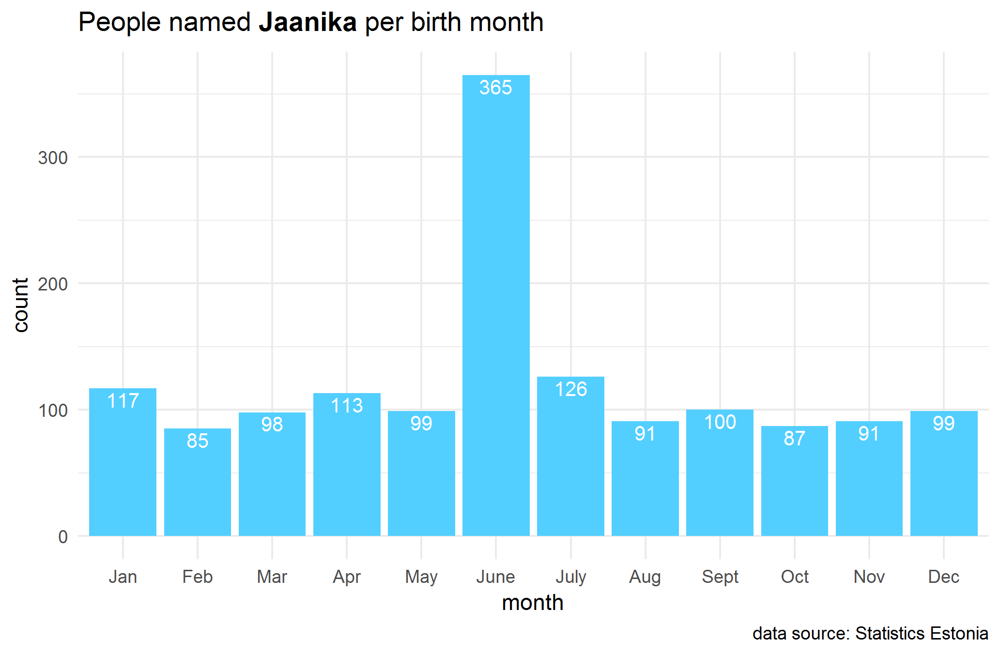

# nimi

`nimi` is an R package for accessing data about names from the Statistics Estonia's [name application](https://www.stat.ee/public/apps/nimed/).



## Installation

Use the `devtools` package to install the development version from Github:

```
devtools::install_github("tanelp/nimi", dependencies=TRUE)
```

## Examples

### get_gender(name)

```R
get_gender("Astrid")

# [1] "female"
```

### get_rank(name)

```R
get_rank("Astrid")

#  male female 
#    NA    221
```

### get_count(name)

```R
get_count("Astrid")

#  male female 
#    NA    783
```

### get_count_by_month(name)

```R
get_count_by_month("Jaanika")

# Jan  Feb  Mar  Apr  May June July  Aug Sept  Oct  Nov  Dec 
# 117   85   98  113   99  365  126   91  100   87   91   99
```

### get_normalized_count_by_county(name)

```R
get_count_by_month("Astrid")

#  Viljandi      Põlva     Jõgeva      Tartu      Pärnu      ...
#     10.51       9.35       8.12       7.35       7.18      ...
```


### describe(name)

```R
describe("Astrid")

# [1] "Nime Astrid nimepäev on 27. november."                      
# [2] "2018. aasta 1. jaanuari seisuga on eesnimi Astrid 783 naisel. Astrid on populaarsuselt 221. naisenimi."
# [3] "Vanim Astrid on vanuserühmas 85+, noorim vanuserühmas 0–4."                   
# [4] "Astrid on keskmiselt 52 aasta vanune (mediaanvanus on 56)."
# [5] "Kõige populaarsem on eesnimi Astrid vanuserühmas 85+, kus neid on 10 000 elaniku kohta 18,32."
# [6] "Kõige rohkem on eesnimega Astrid sündinuid jaanuaris, kokku 78."  
# [7] "Kõige populaarsem on eesnimi Astrid Viljandi maakonnas, kus neid on maakonna 10 000 elaniku kohta 10,51."
```
